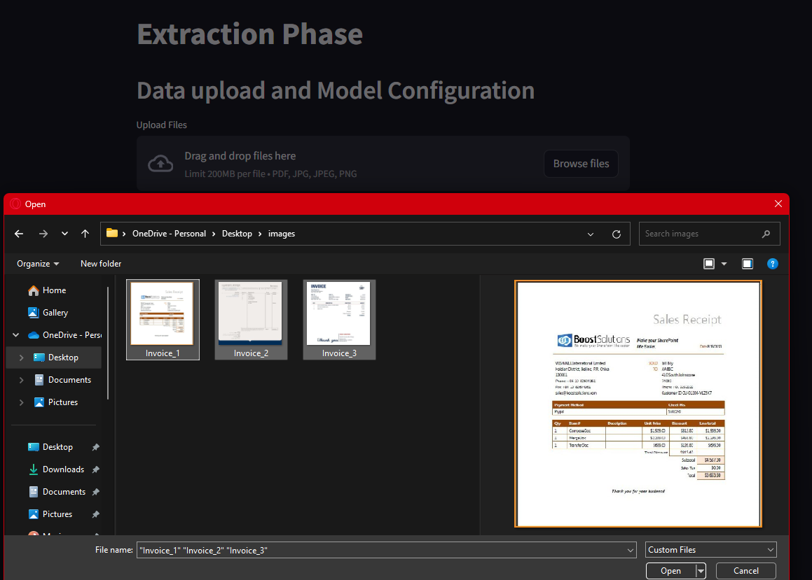
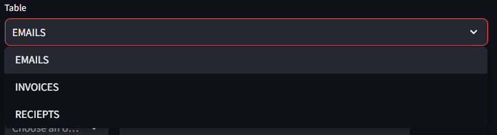
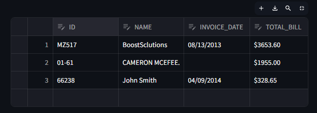
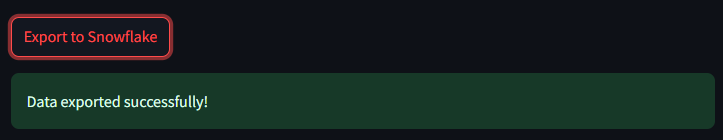

# Automated Data Extractor for Unstructured Data

## 🎯 Overview

This project aims to develop an automated application for extracting and processing unstructured data from documents such as PDFs and images. The application integrates with Snowflake to automatically store the extracted data in a structured format.
<hr style="border: 2px solid darkgray;">

## 👁️ Application preview


<hr style="border: 2px solid darkgray;">

## ⚛️ Technologies Used

- **Streamlit**: For building the web interface.
- **Snowflake**: For data storage and management.
- **Transformers**: For leveraging AI models for document question-answering.
- **Pillow (PIL)**: For image processing.
- **pdf2image**: For converting PDF pages to images.
- **PyCharm**: IDE for integrated development and debugging.
- **GitHub**: For version control and collaboration.

<div style="text-align: center">
    
    
    
    
    
    
</div>

<hr style="border: 2px solid darkgray;">

## 🔧 Installation

1. **Clone the Repository**

   ```bash
   git clone https://github.com/Yessine-BenHamroun/BI4YOU_Project.git
   cd <repository-directory>

2. **Install Required Libraries**

   ```bash
   pip install -r requirements.txt

3. **Setup Environment Variables**\
   Create a .env file in the root directory and add your Snowflake credentials:

   ```bash
   SNOWFLAKE_USER=your_username
   SNOWFLAKE_PASSWORD=your_password
   SNOWFLAKE_ACCOUNT=your_account
<hr style="border: 2px solid darkgray;">

## 🤖 Running the application

1. **Start the Streamlit Application**
   ```bash
   streamlit run streamlit_app.py

2. **Access the Application**\
   Open a web browser and navigate to http://localhost:8501.
<hr style="border: 2px solid darkgray;">

## 👨🏻‍💻 Usage

1. **Upload Data: Import your documents (PDFs or images) to be processed by pressing on "Browse files".**
---
   

2. **Select Database: Choose the Snowflake database you want to use.**
---


3. **Select Schema: Choose the schema within the selected database.**
---


4. **Select Table: Choose the table where the extracted data will be stored.**
---


5. **Specify Columns: Indicate which columns will store the answers to your question.**
---


6. **Ask Questions: Enter the questions you want to ask about the documents.You can add more questions by pressing on "Add Question"**
---


7. **Review Results: Modify or delete the extracted data if necessary.**
---


You can preview results in full screen as well to help you manage multiple data.



8. **Export to Snowflake: Confirm and export the data to the selected Snowflake table**
---


Uploaded data to Snowflake:


<hr style="border: 2px solid darkgray;">

## 🚀 Features
1. **Dynamic Question Management: Add, edit, and delete questions for data extraction.**
2. **Data Editing: Modify and review extracted data before exporting.**
3. **Multi-File Support: Process multiple files simultaneously.**
4. **Automated Data Storage: Automatically load extracted data into Snowflake.**


